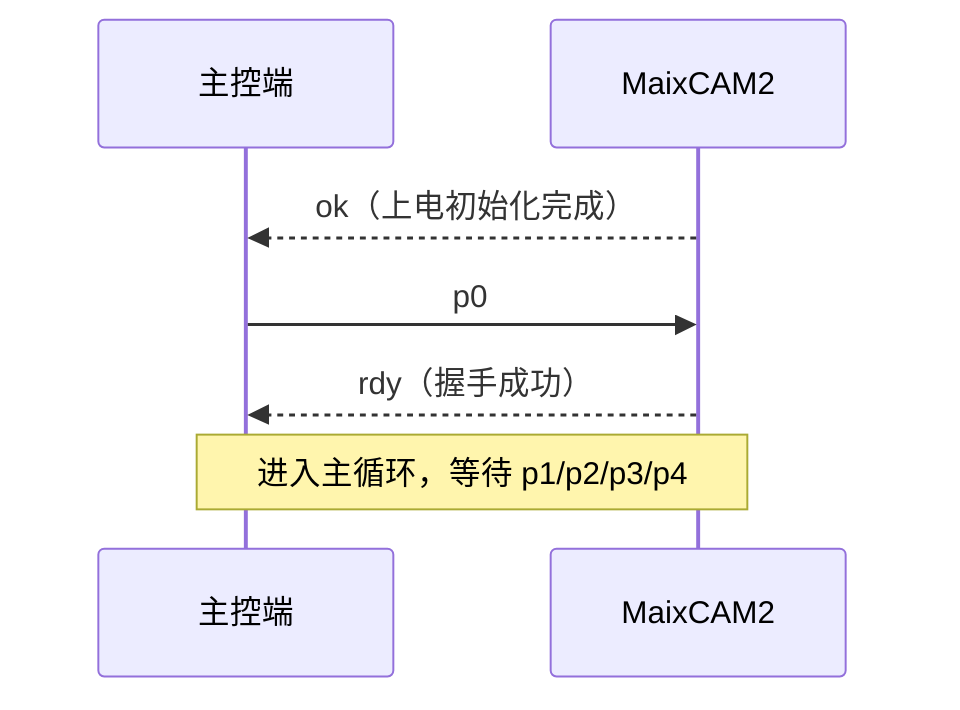
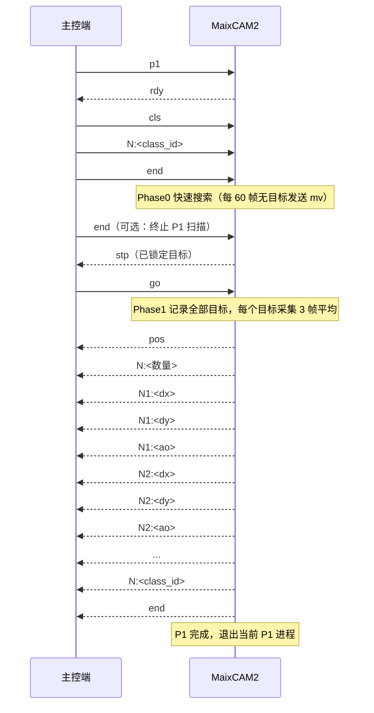
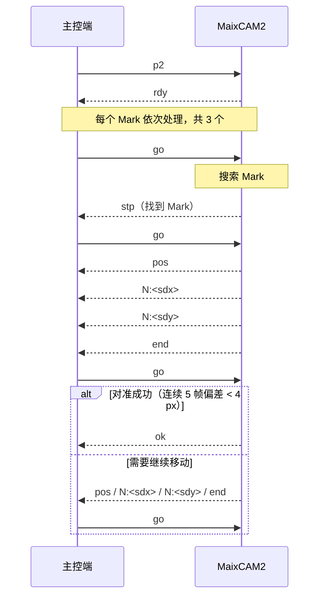
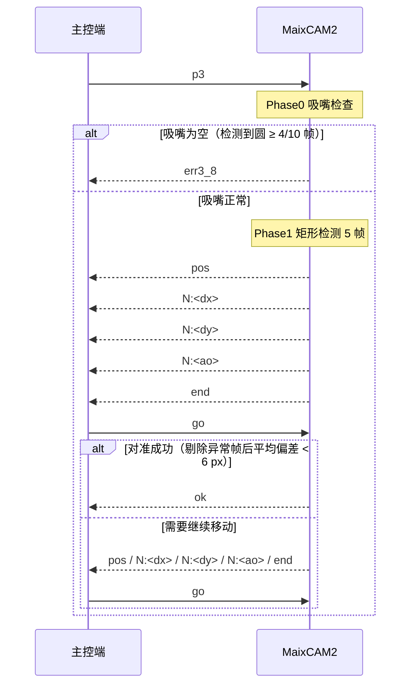
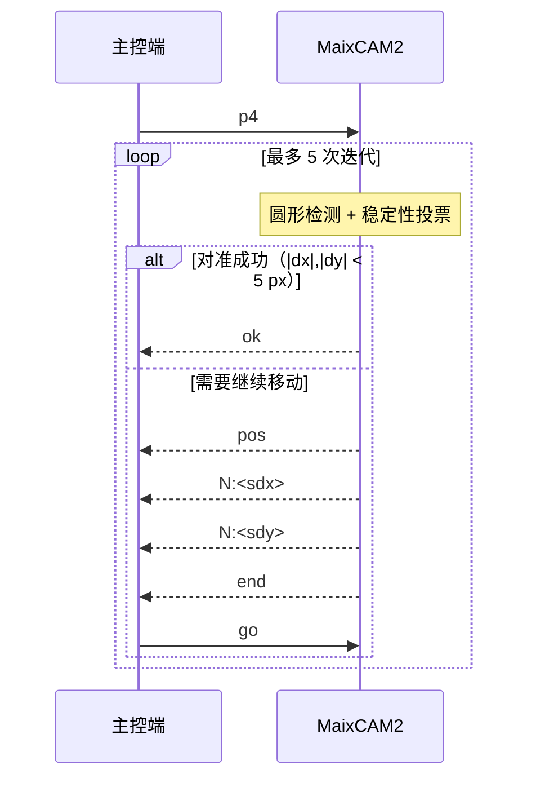

# MaixCAM2 与主控端通讯接口文档


## 一、系统架构总览

```
┌────────────────────────────┐
│          主控端             │
│  (PLC / 上位机 / 运动控制)  │
│            │  ▲             │
│   UART TTL │  │ 串口帧协议   │
│   (115200) │  │             │
└────────────┼──┴─────────────┘
             │
      ┌──────┴───────┐
      │  MaixCAM2    │
      │  (视觉从站)   │
      └──────────────┘
         │          │
   上相机 320x320   下相机 USB 640x480
   (P1/P2)         (P3/P4)

辅助通道（可选，不影响控制协议）：
MaixCAM2 --HTTP POST JPEG--> 云服务器 124.222.148.162:8080
```

控制通道为 **MaixCAM2 串口 UART**，主控端作为主机发送指令，MaixCAM2 作为从机执行视觉流程并上报结果。

---

## 二、串口配置

### 2.1 参数表

| 项目 | 值 | 来源 |
|---|---|---|
| 串口设备 | `/dev/ttyS1` | `SERIAL_CONFIG["device"]` |
| 波特率 | 115200 | `SERIAL_CONFIG["baudrate"]` |
| 接收超时 | 2000 ms | `RECEIVE_TIMEOUT_MS` |
| 读取缓冲 | 64 字节/次 | `READ_CHUNK_SIZE` |
| TX 引脚 | A30，功能 `UART1_TX` | `UART_PIN_CONFIG` |
| RX 引脚 | A31，功能 `UART1_RX` | `UART_PIN_CONFIG` |

数据位/校验位/停止位未在代码中显式指定，采用 MaixPy `uart.UART` 默认参数（通常为 8N1）。

### 2.2 接线

- 主控端 TX → MaixCAM2 RX（A31）
- 主控端 RX ← MaixCAM2 TX（A30）
- 双方共地 GND

TTL 电平，注意主控端与 MaixCAM2 电平匹配（3.3V）。

---

## 三、帧协议格式

所有消息都封装为统一帧：

```
+--------+--------+--------+------------------------+--------+
| 0x7E   | LEN_H  | LEN_L  | PAYLOAD (UTF-8 文本)    | 0x7F   |
+--------+--------+--------+------------------------+--------+
| 帧头 1 | 长度 2（大端序，高字节在前） | LEN 个字节，最大 65535 | 帧尾 1 |
+--------+--------+--------+------------------------+--------+
```

### 3.1 字段说明

| 字段 | 长度 | 说明 |
|---|---|---|
| 帧头 | 1 字节 | 固定 `0x7E` |
| LEN | 2 字节 | 负载字节数，大端序（高字节在前），范围 0~65535 |
| PAYLOAD | LEN 字节 | UTF-8 编码的 ASCII 文本指令 |
| 帧尾 | 1 字节 | 固定 `0x7F` |

### 3.2 限制与特点

- 负载最大 65535 字节（约 64KB）；超过时发送端会截断并打印警告。
- 协议无校验和/CRC，依靠“长度 + 帧尾”校验；主控端建议自行增加超时重传机制。
- 接收端为状态机：等帧头 → 等长度高字节 → 等长度低字节 → 收数据 → 等帧尾；帧尾错误会丢弃整帧并复位。
- 接收端每帧负载按 UTF-8 解码为字符串后返回。
- 负载内出现 `0x7E`/`0x7F` 不会影响收帧（接收机在数据态不做边界判断），但协议未做转义，约定双方负载统一使用 ASCII 文本。

### 3.3 帧示例

| 消息 | 完整帧（HEX） |
|---|---|
| `ok` | `7E 00 02 6F 6B 7F` |
| `go` | `7E 00 02 67 6F 7F` |
| `pos` | `7E 00 03 70 6F 73 7F` |
| `end` | `7E 00 03 65 6E 64 7F` |
| `stp` | `7E 00 03 73 74 70 7F` |
| `err0` | `7E 00 04 65 72 72 30 7F` |
| `N:123` | `7E 00 05 4E 3A 31 32 33 7F` |
| `N:-100` | `7E 00 06 4E 3A 2D 31 30 30 7F` |

> 负载不超过 255 字节时，LEN 高字节为 `0x00`。

---

## 四、消息总览

### 4.1 主控端 → MaixCAM2（下行指令）

| 消息 | 含义 |
|---|---|
| `p0` | 握手请求；MaixCAM2 应答 `rdy`。主循环中再次收到时执行重握手 |
| `p1` | 启动 P1：上相机 YOLO11-OBB 单次检测对位 |
| `p2` | 启动 P2：Mark 多点寻标对位 |
| `p3` | 启动 P3：下相机单次检测对位 |
| `p4` | 启动 P4：下相机圆形标定对位 |
| `cls` | P1 专用：告知将要下发目标类别，后跟 `N:<class_id>`，最后以 `end` 结束 |
| `N:<int>` | 通用数字消息；P1 中表示目标类别 ID（0/1/2） |
| `go` | 允许继续：视觉锁定后运动机构完成移动，通知 MaixCAM2 继续下一阶段 |
| `end` | 终止/结束当前子流程 |
| `rst` | 管理指令：重启当前程序；重启完成（初始化完成）后 MaixCAM2 重新发送 `ok` |
| `quit` | 管理指令：退出当前程序；退出后不自动重启，下次上电开机自启仍会运行 |
| `srst` | 管理指令：重启系统；系统启动后开机自启程序重新运行并发送 `ok` |

### 4.2 MaixCAM2 → 主控端（上行应答）

| 消息 | 含义 |
|---|---|
| `ok` | 启动初始化完成（含 `rst`/`srst` 重启后）；P2 Mark 对准成功；P3 对准成功；P4 对准成功 |
| `rdy` | 就绪：P0 握手成功；P1/P2 收到对应进程指令后准备就绪 |
| `stp` | 视觉已锁定目标，请运动机构停止/到位 |
| `mv` | P1 Phase0 连续 60 帧 YOLO 未检测到目标，请求主控端移动视野切换；可重复发送 |
| `pos` | 位置结果开始标志，后跟若干 `N:<int>`，以 `end` 结束 |
| `N:<int>` | 位置/角度/类别数值 |
| `end` | 数据或流程结束 |
| `err0` | 看门狗超时（30 s 无指令）或 P0 握手超时 |
| `err1_1` | P1 Phase0 相机连续失败累计达到上限 |
| `err1_3` | P1 等待 `go` 超时（或期间收到 `end`） |
| `err1_4` | P1 Phase1 相机连续读帧失败达到上限 |
| `err1_5` | P1 Phase1 未检测到目标 |
| `err1_6` | （已废弃）P1 不再循环修正，当前版本不发送 |
| `err2_1` | P2 searching 阶段等待 `go` 超时（或期间收到 `end`） |
| `err2_3` | P2 未找到 Mark / pos_detect 有效帧不足或5帧一致性校验失败 |
| `err2_4` | P2 对准迭代达到上限仍未对准 |
| `err3_1` | P3 下相机初始化失败 |
| `err3_5` | P3 未检测到矩形 |
| `err3_6` | P3 对准阶段等待 `go` 超时（或期间收到 `end`） |
| `err3_7` | P3 对准迭代达到上限（7 次）仍未对准 |
| `err3_8` | P3 吸嘴检查为空（检测到圆） |
| `err4_1` | P4 下相机初始化失败 |
| `err4_2` | P4 第 1 次迭代未获得稳定检测结果 |
| `err4_3` | P4 后续迭代未获得稳定检测结果 |
| `err4_4` | P4 达到最大迭代次数仍未对准 |
| `err4_5` | P4 等待 `go` 超时（或期间收到 `end`） |

> 说明：`usart.py` 还提供 `send_track()`（`T:0x%02X`），当前 `main.py` 未使用，属于预留辅助接口。

### 4.3 系统管理指令与上电时序

管理指令 `rst`/`quit`/`srst` 在 MaixCAM2 的**每个进程、每个状态机的每个状态**下都会被读取，收到后立即执行，不等待当前流程结束：

| 指令 | 帧（HEX） | 执行动作 |
|---|---|---|
| `rst` | `7E 00 03 72 73 74 7F` | 重启当前程序（`app.restart()`） |
| `quit` | `7E 00 04 71 75 69 74 7F` | 退出当前程序（`app.exit()`） |
| `srst` | `7E 00 04 73 72 73 74 7F` | 重启整个系统（Linux `reboot`） |

推荐的上电/复位时序：

1. 主控复位后、发送握手 `p0` 之前，先发送 `rst` 重启 MaixCAM2 程序。
2. MaixCAM2 重启后重新完成摄像头、模型、串口等初始化，并在初始化完成时主动发送 `ok`（对应 `main.py` 初始化第 8 步）。
3. 主控收到 `ok` 后再发送 `p0` 握手，MaixCAM2 应答 `rdy`，进入正常流程。

`quit` 后 MaixCAM2 不会发送 `ok`，串口进入静默状态；`srst` 后系统重启，重启完成后同样由自启程序发送 `ok`。

---

## 五、P0 握手流程

### 5.1 时序



### 5.2 规则

- MaixCAM2 上电完成相机、模型、串口、LED 初始化后，主动发送 `ok`。
- 主控端应在 30 s 内发送 `p0`，MaixCAM2 收到后应答 `rdy`。
- 握手期间 30 s 未收到 `p0`，MaixCAM2 每 30 s 发送一次 `err0`，继续等待。
- 主循环中任何时刻收到 `p0` 都会重新应答 `rdy`（重握手）。

---

## 六、P1 流程：上相机 YOLO11-OBB 单次检测对位

### 6.1 时序



### 6.2 目标类别

| class_id | 类别名 |
|---|---|
| 0 | `ccap`（电容） |
| 1 | `cled`（LED） |
| 2 | `cres`（电阻） |

主控端发送顺序固定为：`cls` → `N:<class_id>` → `end`。

- 若 30 s 内未完成类别下发，或中途收到非预期指令，MaixCAM2 使用默认类别 0 继续。
- class_id 越界时会被钳制到 0~2。

### 6.3 流程细节

1. 收到 `p1` 后，MaixCAM2 复位接收状态、点亮 LED、应答 `rdy`。
2. 等待主控端下发目标类别。
3. 将上相机切换为 320×320 @ 50 fps。
4. **Phase0 快速搜索**：对每帧运行 YOLO11-OBB，选择目标类别中离图像中心最近的检测框；一帧识别到即锁定。
   - 连续 5 帧读帧失败触发相机重建；
   - 累计 50 帧失败 → 上报 `err1_1` 并退出；
   - 每处理 60 帧（`scan_limit_frames`）均未检测到目标 → 发送 `mv` 请求主控端移动视野，随后清零计数继续扫描，可反复发送 `mv`；
   - 扫描过程中收到主控端 `end` → 退出 P1 进程，回到主循环等待 `p0`/`p1`/`p2`/`p3`/`p4`。
5. 锁定后发送 `stp`，等待主控端 `go`（超时 30 s 或期间收到 `end` 均上报 `err1_3` 后退出）。
6. **Phase1 全目标采集**：收到 `go` 后逐帧检测，第一次检测到目标类别时，记录该帧视野范围内的**全部**目标类元件，不再只取离视野中心最近的一个。
   - 对记录到的**每个目标**分别采集 3 帧（`init_frames`），逐帧按位置匹配后计算相对图像中心的 `dx`/`dy` 与角度偏差并取平均；CLED 类别额外使用 CV 切角修正角度；
   - 相机连续读帧失败达到上限 → `err1_4`；全部帧均未检测到 → `err1_5`。
7. 上报结果：`pos` + 数量 + 每个目标的 `N<序号>:<dx/dy/ao>` + `N:<class_id>` + `end`，一次发完。
8. 上报完成后直接退出当前 P1 进程，**不再进入循环修正**，不等待 `go`，也不发送 `ok`。

### 6.4 上报数据格式

```
pos
N:<数量>    视野内目标类元件总数，整数
N1:<dx>     第 1 个目标 X 方向电机运动步数，整数
N1:<dy>     第 1 个目标 Y 方向电机运动步数，整数
N1:<ao>     第 1 个目标角度偏差，0.01°，整数
N2:<dx>     第 2 个目标 X 方向电机运动步数，整数
N2:<dy>     第 2 个目标 Y 方向电机运动步数，整数
N2:<ao>     第 2 个目标角度偏差，0.01°，整数
...
N:<class_id> 目标类别 0/1/2
end
```

> 注：目标按离视野中心由近到远排序，`N1` 为离视野中心最近的目标。

角度计算公式（代码逻辑）：

```
ao  = int(环形平均(角度°) * 100)
```

> 注：`dx`/`dy` 已是电机运动步数，主控端直接按接收值作为电机步数使用，无需换算或额外处理。角度环形平均按 180° 周期进行（CLED 类别按 360° 周期）。


## 七、P2 流程：Mark 多点寻标对位

### 7.1 时序



### 7.2 流程细节

1. 收到 `p2` 后，MaixCAM2 复位接收状态，将上相机切换为 320×320 @ 50 fps 并完成预热后，再应答 `rdy`；主控端收到 `rdy` 后再发送 `go`。
   - 收到 `go` 后立即读取并处理第一帧画面，不再等待相机初始化。
2. 依次处理 **3 个 Mark**（`target_count = 3`）。
3. 每个 Mark 分三个阶段：

   **searching（搜索）**
   - 收到 `go` 后立即读取当前帧并执行 Mark 检测。
   - 等待主控端 `go`（30 s 超时或期间收到 `end` 均上报 `err2_1` 后退出）。
   - 最长搜索约 30 s（`search_timeout_s` × 5 = 300 次尝试，每次约 100 ms）。
   - 找到 Mark 后发送 `stp`；未找到 → `err2_3`。

   **pos_detect（定位）**
   - 等待主控端 `go`（30 s 超时退出）。
   - 最多尝试 500 次（`pos_max_try`），采集 5 帧（`pos_frames`）后校验一致性：任一帧中心与 5 帧中位数偏差超过 `pos_dev_th`（4 px）则整批重新采集；始终凑不齐一致 5 帧 → `err2_3`。
   - 取平均后上报 `pos` + `N:<sdx>` + `N:<sdy>` + `end`。

   **aligning（对准迭代）**
   - 等待主控端 `go`（30 s 超时退出）。
   - 每轮采集 5 帧；若 5 帧 |dx| 与 |dy| 均 < 4 px，判定对准成功，发送 `ok`，进入下一个 Mark。
   - 否则上报新的 `pos` 数据；达到最大 7 次迭代仍不对准 → `err2_4`。

4. 任意阶段收到 `end` 都会中止 P2。
5. 3 个 Mark 全部完成后 P2 正常结束；主控端可通过收到 3 次 `ok` 判断完成。

### 7.3 上报数据格式

```
pos
N:<sdx>  X 方向电机运动步数，整数
N:<sdy>  Y 方向电机运动步数，整数
end
```

> 注：`sdx`/`sdy` 已是电机运动步数，主控端直接按接收值作为电机步数使用，无需换算或额外处理。


## 八、P3 流程：下相机单次检测对位

### 8.1 时序



### 8.2 流程细节

1. 收到 `p3` 后，MaixCAM2 复位接收状态、点亮 LED。
2. 若下相机（USB index 0，640×480 @ 60 fps）初始化失败 → `err3_1`。
3. **Phase0 吸嘴检查**：连续检查 10 帧（`nozzle_check_frames`），检测到圆形轮廓的帧数 ≥ 4（`nozzle_detect_threshold`）判定吸嘴为空（检测到圆 = 空吸嘴，反逻辑），上报 `err3_8` 并退出。
4. **Phase1 矩形检测**：Canny + 多边形逼近检测矩形，每帧取离图像中心最近的矩形，共采集 7 帧（`avg_frames`，最多尝试 40 次）。
   - 一帧矩形都没有 → `err3_5`；求平均前剔除与中位数偏差超过 4 px（`avg_outlier_th`）的异常帧（至少保留 3 帧）。
5. 计算中心偏差与角度环形平均，上报结果。
6. **重复修正偏差（aligning）**：等待主控端 `go`（超时 30 s 或期间收到 `end` 均上报 `err3_6` 后退出）。
   - 每轮采集 7 帧（`align_frames`，最多尝试 40 次），剔除与中位数偏差超过 4 px（`align_outlier_th`）的异常帧（至少保留 3 帧）后取平均；若平均 |dx| 与 |dy| 均 < 6 px（`align_th`），判定对准成功，发送 `ok`，P3 完成。
   - 否则上报新的 `pos`（`dx`/`dy`/`ao`）并继续等待 `go`；达到最大 7 次（`align_max_iter`）仍未对准 → `err3_7`。
   - 每轮检测修正后打印一次平均 dx/dy（及角度）到日志。

### 8.3 上报数据格式

```
pos
N:<dx>  X 方向电机运动步数，整数
N:<dy>  Y 方向电机运动步数，整数
N:<ao>  角度偏差，0.01°，整数
end
```

角度计算公式（代码逻辑）：

```
ao  = int(mean(角度°) × 100)
```

> 注：`dx`/`dy` 已是电机运动步数，主控端直接按接收值作为电机步数使用，无需换算或额外处理。


## 九、P4 流程：下相机圆形标定对位

### 9.1 时序



### 9.2 流程细节

1. 收到 `p4` 后，MaixCAM2 复位接收状态、点亮 LED。
2. 下相机初始化失败 → `err4_1`。
3. 最多迭代 **5 次**（`max_iter`），每次迭代最多扫描 120 帧。
4. 使用暗色团块圆形检测，结合稳定性（连续 5 帧）与投票（最近 8 帧中稳定帧占比 ≥ 85%）判定可靠圆心；连续 10 帧（`reset_frames`）无稳定结果时清零稳定性计数与投票历史，重新统计。
   - 第 1 次迭代无稳定结果 → `err4_2`；
   - 后续迭代无稳定结果 → `err4_3`。
5. 若 |dx| 与 |dy| 均 < 5 px，发送 `ok`，P4 结束。
6. 否则发送 `pos` + `N:<sdx>` + `N:<sdy>` + `end`；若还有后续迭代，等待 `go`（30 s 超时或期间收到 `end` 均上报 `err4_5` 后退出）。
7. 5 次迭代均未对准 → `err4_4`。

### 9.3 上报数据格式

```
pos
N:<sdx>  X 方向电机运动步数，整数
N:<sdy>  Y 方向电机运动步数，整数
end
```

> 注：`sdx`/`sdy` 已是电机运动步数，主控端直接按接收值作为电机步数使用，无需换算或额外处理。


## 十、看门狗机制

- `WATCHDOG_TIMEOUT_MS = 30000`（30 s）。
- P0 握手阶段：30 s 未收到 `p0`，每 30 s 上报一次 `err0`。
- 主循环阶段：30 s 内未收到任何指令，每 30 s 上报一次 `err0`。
- 任意指令（包括未知指令）都会刷新看门狗计时。

---

## 十一、错误码汇总

| 错误码 | 触发场景 |
|---|---|
| `err0` | P0 握手超时 / 主循环 30 s 无指令 |
| `err1_1` | P1 Phase0 累计 50 帧相机读帧失败 |
| `err1_3` | P1 锁定后等待 `go` 超时（或期间收到 `end`） |
| `err1_4` | P1 Phase1 相机连续读帧失败达到上限 |
| `err1_5` | P1 Phase1 采集帧均无检测结果 |
| `err1_6` | （已废弃）P1 不再循环修正，当前版本不发送 |
| `err2_1` | P2 searching 等待 `go` 超时（或期间收到 `end`） |
| `err2_3` | P2 未找到 Mark / pos_detect 有效帧不足或5帧一致性校验失败 |
| `err2_4` | P2 对准迭代 7 次仍未对准 |
| `err3_1` | P3 下相机初始化失败 |
| `err3_5` | P3 未检测到矩形 |
| `err3_6` | P3 对准阶段等待 `go` 超时（或期间收到 `end`） |
| `err3_7` | P3 对准迭代 7 次仍未对准 |
| `err3_8` | P3 吸嘴为空（检测到圆） |
| `err4_1` | P4 下相机初始化失败 |
| `err4_2` | P4 第 1 次迭代无稳定结果 |
| `err4_3` | P4 后续迭代无稳定结果 |
| `err4_4` | P4 达到最大迭代次数仍未对准 |
| `err4_5` | P4 等待 `go` 超时（或期间收到 `end`） |

---

## 十二、数据字段与符号约定

### 12.1 数据单位与符号

| 字段 | 约定 |
|---|---|
| `dx` | 电机运动步数，整数；主控端直接按接收到的数值控制电机运动 |
| `dy` | 电机运动步数，整数；主控端直接按接收到的数值控制电机运动 |
| `ao` | P1 与 P3 均为 `角度×100`（0.01°），符号相同 |

主控端无需了解成像方向，直接按 `dx`/`dy` 数值控制电机运动即可。

### 12.2 数值精度

- `N:<int>` 为十进制有符号整数（`%d` 格式化）。
- P1~P4 发送的 `dx`/`dy` 均为**电机运动步数**；主控端直接按接收值作为电机运动步数控制电机运动，无需换算或额外处理。
- 角度均以 0.01° 为单位发送。

### 12.3 各流程输出数值汇总

| 流程 | 相机 | 输出 |
|---|---|---|
| P1 | 上相机 | 电机运动步数 |
| P2 | 上相机 | 电机运动步数 |
| P3 | 下相机 | 电机运动步数 |
| P4 | 下相机 | 电机运动步数 |

> 主控端直接以接收到的 `dx`/`dy` 作为电机运动步数使用，无需换算或额外处理。

---

## 十三、相机视场汇总

| 流程 | 相机 | 分辨率 | 视场范围 | 理论像素当量 |
|---|---|---|---|---|
| P1 | 上相机 | 320 × 320 | **23.5² mm²**（23.5 × 23.5 mm） | 约 0.0734 mm/px |
| P2 | 上相机 | 320 × 320 | **22.3² mm²**（22.3 × 22.3 mm） | 约 0.0697 mm/px |
| P3 | 下相机 | 640 × 480 | **14.7 mm × 11 mm** | X 约 0.0230、Y 约 0.0229 mm/px |
| P4 | 下相机 | 640 × 480 | **14.7 mm × 11 mm** | X 约 0.0230、Y 约 0.0229 mm/px |

> `23.5² mm²` 表示 23.5 mm × 23.5 mm 方形视场，`22.3² mm²` 同理；像素当量为理论换算，实际以标定结果为准。主控端无需使用该当量换算，`dx`/`dy` 已直接为电机运动步数。

---

## 十四、辅助通道：图像上传（HTTP）

除串口控制协议外，MaixCAM2 还包含一路独立的图像上传通道，用于远程监视，不参与控制：

- 上传地址：`http://124.222.148.162:8080/camera/upload`
- 方式：`HTTP POST`，body 为 JPEG 二进制
- 质量：JPEG quality 65
- 行为：只上传最近一帧，由后台线程发送，不阻塞视觉主流程

对应文件：

- `camera_upload.py`：独立连续上传程序（320×320 @ 60 fps）
- `main.py`：内置的“进程结束时上传最后一帧”逻辑
- `maixcam2_guide.md`：云中转/网页端查看指南

---

## 十五、主控端实现要点

1. 主控端按帧格式发送指令，负载为 ASCII 文本，不要附加换行符。
2. 指令名严格区分大小写：`p0`/`p1`/`p2`/`p3`/`p4`/`cls`/`go`/`end`/`rst`/`quit`/`srst`。
3. `pos` 之后的数据为固定字段序列（P1 的目标数量可变），以 `end` 收尾；主控端应缓存完整帧后再解析。
4. P1/P2 收到对应进程指令后会先应答 `rdy`；P3/P4 在收到 `p3`/`p4` 后无 `rdy` 应答，主控端直接等待 `pos`/`ok`/`err*`。
5. P2 共处理 3 个 Mark，以收到 3 次 `ok` 判断整体完成。
6. P1 一次性上报全部目标后直接结束，不进入重复修正；P3 初始 `pos` 后进入重复修正：主控端完成移动后发送 `go`，对准成功收到 `ok`，失败收到 `err3_7`。
7. 主控端应实现串口超时与错误码处理，收到 `err*` 后按错误码表处理或重试。
8. 若主控端 30 s 内无法下发下一步指令，应主动发送 `end` 或处理 `err0`，避免流程失控。
9. 复位/上电后先发 `rst`，等收到 `ok` 再发 `p0`；`rst`/`quit`/`srst` 属于最高优先级管理指令，任意时刻发送都会立即打断当前流程。
10. P1 Phase0 收到 `mv` 后控制电机切换视野即可，MaixCAM2 会清零帧计数继续扫描；需要终止 P1 扫描时发送 `end`。
